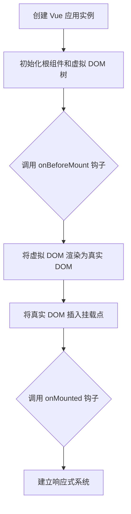

生命周期钩子是为了开发者在vue组件的创建到销毁的不同阶段可以执行自己的逻辑。

在 `index.html` 文件里，我们会添加一个空的 `
`，作为 Vue 应用的显示位置（挂载点）。

`main.ts` 是应用的启动文件，它负责启动 Vue 并把 Vue 应用内容放到我们在 `index.html` 里添加的这个 `
` 中。

`App.vue` 是 Vue 应用的主要组件（根组件）。所有其他组件都在 `App.vue` 里组合和显示，`App.vue` 由 `main.ts` 负责加载和显示。

------

### Vue 实例挂载过程图

Vue 3 实例挂载过程的流程图步骤：

1. **创建 Vue 应用实例**
2. **初始化根组件和虚拟 DOM 树**
3. **调用 `onBeforeMount` 钩子**
4. **将虚拟 DOM 渲染为真实 DOM**
5. **将真实 DOM 插入到挂载点 (e.g., `#app`)**
6. **调用 `onMounted` 钩子**
7. **建立响应式系统**

以下是该流程的流程图表示：

